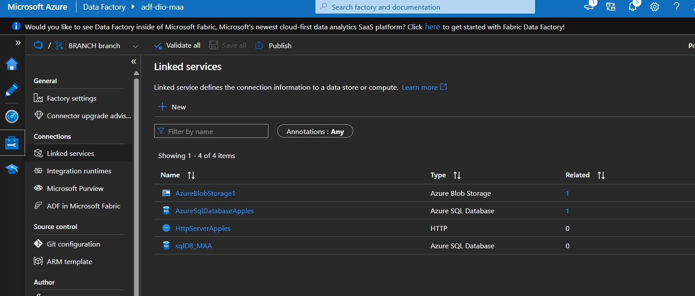
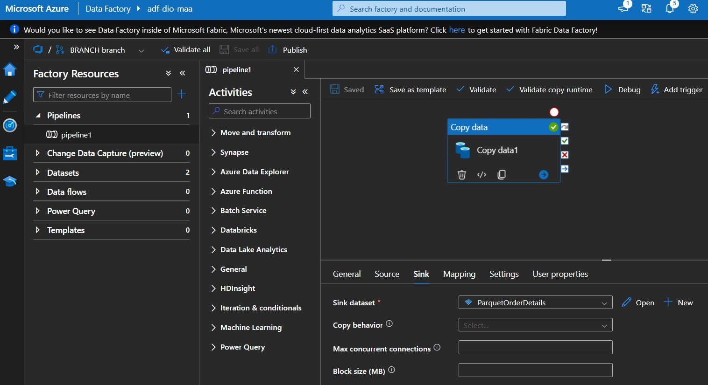
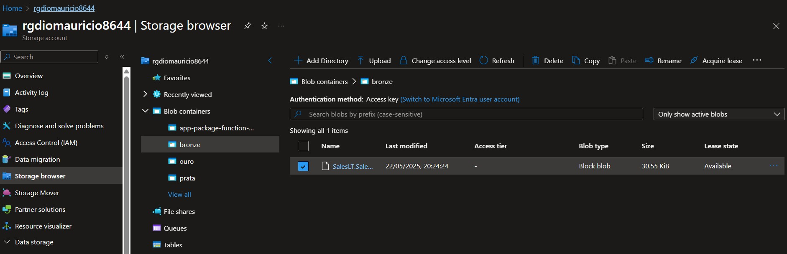

<h1> DESAFIO DE PROJETO: Criando Processos de Redundância de Arquivos na Azure </h1>

  
  
  
  
  

Este Projeto foi realizado por Maurício André de Almeida como trabalho no curso de Microsoft AI for Tech - Azure Databricks na DIO.ME

- Para este trabalho, Criei os seguintes LinkedServices no DataFactory:
  - Azure Blob Storage (para o armazenamento no estilo Medalion: Bronze/Prata/Ouro de arquivos)
  - Azure SQL Database (Banco de dados de teste: AdventureWorks)
  - 

- Criei um Pipeline para copiar uma tabela do BD e gravar no armazenamento bronze como um arquivo do tipo Parquet

- Executei o Pipeline e o arquivo Parquet foi criado no Blob Storage:

# Autor

[  Mauricio Andre de Almeida](https://github.com/mauricioaalmeida) 

